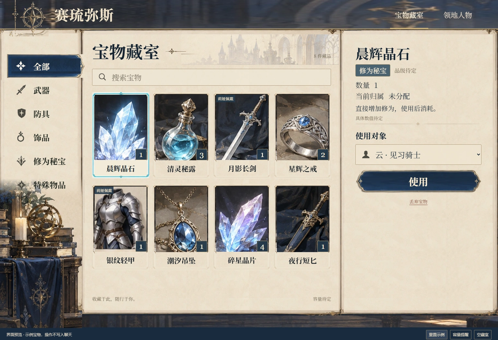
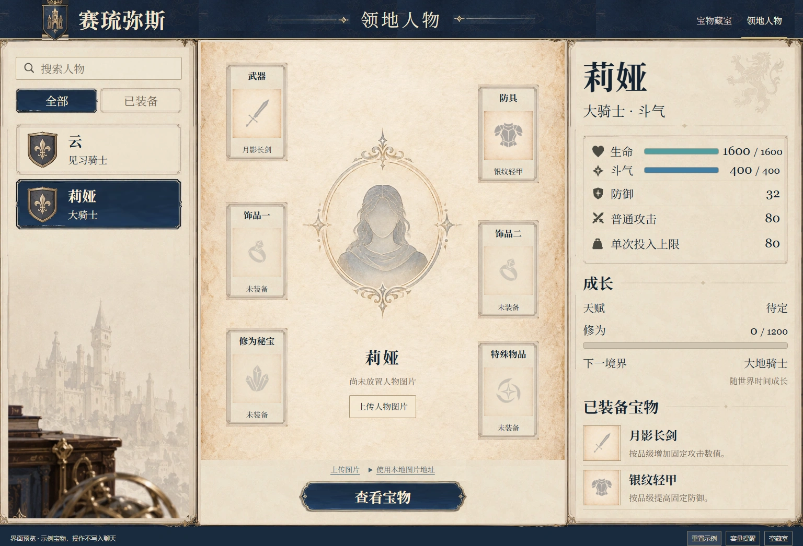

# 人物与宝物界面

[视觉约定](DESIGN.md) · [产品边界](PRODUCT.md)

当前交付为可操作 UI 预览，包含宝物藏室与领地人物两页，沿用已选羊皮纸蓝银概念图。预览不接入酒馆变量，不给 AI 发消息，不生成正式宝物，不执行培养或战斗数值结算。

 

## 查看

从仓库根目录运行：

```powershell
node '赛琉弥斯角色卡/tools/build-treasure-ui.mjs'
node '赛琉弥斯角色卡/tools/serve-treasure-ui.mjs'
```

打开 `http://127.0.0.1:8356/#treasures` 或
`http://127.0.0.1:8356/#people`。本地服务不对外网监听。界面脚本、样式与图片独立加载，编译仅作用于本模块，不触发全仓构建或世界书打包。

交付目录为根 `dist/角色卡玩法规则包/界面/人物与宝物/`；必须连同 `assets/`、`app.js` 和 `style.css`
一起提供，不能只复制 HTML。当前不提供酒馆导入包，因为正式变量接入仍待设计。

## 已有交互

- 宝物分类、搜索、详情、使用对象、演示消耗、佩戴／替换／卸下、静默丢弃和数量选择。佩戴叠放物件时拆出单件，丢弃后装备引用同步消失。
- 人物名册筛选、人物详情、六个示意装备位置，以及从装备跳转宝物、只查看所选人物的宝物。
- 底部独立预览工具可查看容量提醒、空藏室，或重置示例。具体容量和预警比例尚未定，因此不展示虚构的正式容量数字。
- 手机布局按分类、藏品、详情排列，点击藏品定位详情；人物按名册、图片装备、属性排列。

`fixture.ts`
明确为演示数据。云与莉娅的基础面板来自既有确认记录，示例宝物名称、归属及装备仅用来演示布局，刷新或重置恢复示例；使用不会修改真实修为，佩戴不会虚构尚未定稿的加成。

## 人物图片

未上传时使用用户已确认的女性人物徽记：羊皮纸、金色椭圆纹饰与无五官女性剪影，仅作通用占位图，不代表人物的真实外观。上传后以用户图片替换。

上传 PNG、JPG 或 WebP（不超过 8 MB）后，预览服务保存到 `赛琉弥斯角色卡/output/人物与宝物UI/portraits/`，返回
`/portraits/…` 本地 HTTP 地址。`preview-person-portraits.json`
只维护此独立预览中稳定人物 ID 到 URL 的映射，不嵌入图片数据；也可以填写已有本地 HTTP 图片地址。不使用原概念图的中央人物和场景背景。

此映射属于独立预览数据，不是正式聊天存档。正式酒馆接入时要替换为酒馆本地图片上传与当前聊天／有效分支映射，不可复用一个全局人物表给所有聊天。切换人物时正在上传的图片仍归上传开始时的人物。

## 资源来源

`assets/sources.json`
保存 45 份裁剪的来源、坐标和透明区域；另有一张已确认的女性人物徽记。外框、纸面、织物、徽记、物件、书桌、分类图标与按钮取自已选概念图。边框图片挖空中央，文字、数量和状态由 HTML 渲染；没有 SVG 或内嵌图片。

46 张运行时图片统一采用 WebP 质量 95，保留原尺寸与透明通道，总计 722,726 字节，较 PNG 工作图减少 83.9%。编码参数与逐张尺寸见
`assets/webp-manifest.json`。源码资源与发布目录均只提交 WebP；原始概念 PNG、裁剪工作 PNG、用户上传图和浏览器缓存保留在本地，不随本次交付提交。WebP 已齐备，正常构建无需重新裁剪或生图。

名册徽章已去除与图片边缘连通的纸面背景，筛选选中框与人物行分别完整显示；蓝色底纹单次铺满，避免重复接缝。使用对象下拉框按文字和内边距自然撑高，窄窗口下也完整显示文字。

右侧详情已取消物件大图，从名称、分类、数量、归属、效果和操作直接开始，避免重复展示与小图放大。五类宝物正尝试羊皮纸徽记风格；先制作一张武器类样图，等待确认后扩展整套并替换列表素材。试稿保存在项目 output，不参与运行时加载。

若需重新裁剪：

```powershell
& '赛琉弥斯角色卡/tools/crop-treasure-ui-assets.ps1' -SourceDirectory '赛琉弥斯角色卡/output/人物与宝物面板概念/2026-10-02' -TargetDirectory '赛琉弥斯角色卡/src/角色卡玩法规则包/界面/人物与宝物/assets'
node '赛琉弥斯角色卡/tools/compress-treasure-ui-assets.mjs'
```

裁剪依赖本地保留的两张概念 PNG；女性底图工作 PNG 单独保留于
`assets/portrait-default-female.png`。压缩使用本机 Chrome 的 WebP 编码器，不安装其他图像软件；如 Chrome 位于其他位置，可设置
`TREASURE_UI_CHROME`。局部构建命令见上文。

已完成本模块构建与 1536px /
390px 两页显示检查，没有横向溢出、图片加载失败、SVG 或内嵌图片。仅进行一批视觉修整与一次确认，未运行全仓测试。

## 运行接入待办

宝物获取门槛、投放剧情方式、生成频率与条件仍待研究，本轮不作决定。入库仅由脚本确认是否属于自己的生成记录并防重，不增设严格 AI 回执。

正式库存、基础／有效属性、效果处理器、装备槽位规则、容量、天赋速率与分支隔离须在玩法接入时落实。丢弃不向 AI 发通知；其他正文事实是否并入通用汇总器按根约定另定，不因 UI 可点击而自动启用。

工作区的权威记录位于 `赛琉弥斯角色卡/docs/人物培养与宝物管理需求.md` 与 `赛琉弥斯角色卡/docs/功能与世界书对接待办.md`
的 INT-14。本次独立界面交付不打包其他模块及世界书。
